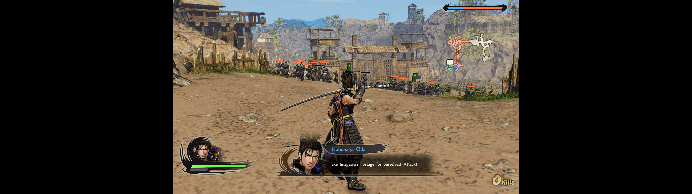

# SAMURAI WARRIORS 5 Fix


***This project is designed exclusively for Windows due to its reliance on Windows-specific APIs.***

## Fixes
- Adds ultrawide resolutions to the in-game Graphics menu's resolution list
- Unstretches and repositions the 2D UI and world-space HUD (menus, text, minimap, nameplates, health bars, markers)
- Widens the NPC visibility/culling frustum so characters no longer disappear off the sides of the screen

## Build and Install
Requires:
- [Rust](https://www.rust-lang.org/tools/install) (cargo)
- [Python 3](https://www.python.org/downloads/)

1. Clone:
```ps1
git clone https://github.com/PolarWizard/samurai-warriors5-fix.git
cd samurai-warriors5-fix
```
2. Install [Ultimate ASI Loader](https://github.com/ThirteenAG/Ultimate-ASI-Loader) into the game folder (only needed once):
```ps1
python scripts/loader.py "<path to 'SAMURAI WARRIORS 5' folder>"
```
3. Build and install the fix:
```ps1
python scripts/install.py "<path to 'SAMURAI WARRIORS 5' folder>"
```
This builds a release DLL with `cargo` and copies it to `<game folder>/scripts/samurai_warriors5_fix.asi`, along with a default config on first install. Pass `--debug` to build and install a debug build instead.

If you're using VS Code, the same steps are wired up as tasks in `.vscode/tasks.json` (`loader`, `install`, `build and install`) -- edit the game folder path in there to match your install first.

## Configuration
- Edit `<game folder>/scripts/samurai_warriors5_fix.toml`

## Screenshots
|  |
| --- |
| <p align='center'> Fix disabled → Fix enabled </p> |

## License
Distributed under the MIT License. See [LICENSE](LICENSE) for more information. Third-party license text for every dependency can be generated with `python scripts/licenses.py`, which writes it out to `LICENSES`.
